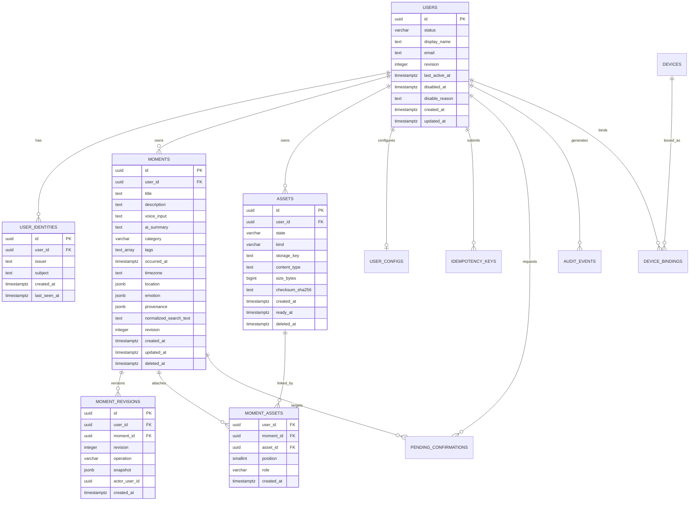

# PostgreSQL 与 MinIO 存储数据模型

> 文档状态：Draft 1.0  
> 更新日期：2026-08-01  
> 适用范围：Moment One Cloud Core / `MomentOneServer`

## 1. 文档目的

本文把 [Moment One 领域模型](../domain/MOMENT_DOMAIN_MODEL.md) 映射为 PostgreSQL 关系数据和 MinIO 对象数据，规定表职责、关系、主要约束、索引和生命周期。

本文是首个 Alembic migration 的设计输入，不是已经执行的 migration。截至 2026-08-01，仓库尚无业务表 migration。

## 2. 存储原则

1. PostgreSQL 是云端业务事实源，保存身份映射、Moment、版本、关联、状态、确认和审计。
2. MinIO 保存图片、音频、视频等文件字节；PostgreSQL 只保存对象元数据和引用。
3. 当前快照与历史版本分开：`moments` 面向常用查询，`moment_revisions` 面向历史、审计和冲突处理。
4. 用户所有权进入每条核心记录和查询条件，不能只依赖应用层“先查再判断”。
5. 可搜索、排序、约束的稳定字段使用普通列；尚未稳定且很少按子字段查询的结构可使用 `jsonb`。
6. AI 摘要、搜索文本、缩略图等可重建数据不能成为唯一事实副本。
7. Redis 如未来引入，只用于缓存、限流、队列或短期协调，不作为业务真相来源。

## 3. 分阶段表范围

### 3.1 Phase 1：Identity 与 Moment Core

```text
users
user_identities
moments
moment_revisions
idempotency_keys
audit_events
```

### 3.2 Phase 2：媒体、配置与设备绑定

```text
assets
moment_assets
user_configs
devices
device_bindings
```

### 3.3 Phase 3：安全删除

```text
pending_confirmations
```

### 3.4 Phase 4 以后

```text
sync_cursors
sync_change_log
oauth_clients
access_grants
agent_connections
ai_artifacts
search_embeddings
```

`devices` 和 `device_bindings` 在 Phase 2 引入，因为眼镜端扫码绑定（QR Binding）是 MVP 的核心授权流程。`devices` 记录设备注册信息，`device_bindings` 记录设备与用户的长期绑定关系（可撤销）。详见 `docs/roadmap/MCP_MVP_PLAN.md` §2.5。

## 4. 实体关系图



## 5. 表定义

以下类型和长度是 migration 的推荐基线；在生成 migration 前仍应通过 API 契约测试确认最终长度。

### 5.1 `users`

内部用户主表，不保存 Casdoor 密码或 Token。

| 列 | 推荐类型 | Null | 说明 |
|---|---|---:|---|
| `id` | `uuid` | 否 | 主键 |
| `status` | `varchar(32)` | 否 | `active/disabled/deleting/deleted` |
| `revision` | `integer` | 否 | 管理操作乐观锁版本，初始为 1 |
| `display_name` | `text` | 是 | 展示资料 |
| `email` | `text` | 是 | 资料字段，不作为身份主键 |
| `last_active_at` | `timestamptz` | 是 | 最近业务访问时间，允许节流更新 |
| `disabled_at` | `timestamptz` | 是 | 应用访问被停用的时间 |
| `disable_reason` | `varchar(240)` | 是 | 脱敏的管理原因，不存私密正文 |
| `created_at` | `timestamptz` | 否 | 服务端时间 |
| `updated_at` | `timestamptz` | 否 | 服务端时间 |

约束与索引：

```text
PRIMARY KEY (id)
CHECK status IN (...)
CHECK revision >= 1
INDEX (status)
```

不建议默认对 email 加唯一约束，因为身份提供方、大小写和账号合并规则尚未冻结。

### 5.2 `user_identities`

外部 OIDC 身份到内部用户的映射。

| 列 | 推荐类型 | Null | 说明 |
|---|---|---:|---|
| `id` | `uuid` | 否 | 主键 |
| `user_id` | `uuid` | 否 | FK -> users.id |
| `issuer` | `text` | 否 | 标准化后的 OIDC issuer |
| `subject` | `text` | 否 | OIDC `sub` |
| `created_at` | `timestamptz` | 否 | 首次映射时间 |
| `last_seen_at` | `timestamptz` | 否 | 最近认证时间 |

关键约束：

```text
UNIQUE (issuer, subject)
INDEX (user_id)
```

### 5.3 `moments`

Moment 当前有效快照。列表、详情、过滤和大部分搜索直接读取本表。

| 列 | 推荐类型 | Null | 说明 |
|---|---|---:|---|
| `id` | `uuid` | 否 | 主键，可接受合规客户端预生成 UUID |
| `user_id` | `uuid` | 否 | 所有者 |
| `title` | `text` | 否 | 用户标题 |
| `description` | `text` | 是 | 用户正文 |
| `voice_input` | `text` | 是 | 原始口述文本/确认转写 |
| `ai_summary` | `text` | 是 | 可重建派生摘要 |
| `category` | `varchar(32)` | 否 | v1 Category |
| `moment_type` | `varchar(32)` | 否 | 记录类型标识，默认 `'general'`；内置类型注册表驱动（bookkeeping / habit / general 兜底），见 `docs/domain/MOMENT_RECORD_TYPES.md`（ADR-0017） |
| `payload` | `jsonb` | 否 | 类型化扩展字段，默认 `'{}'`；按 `contracts/types/*.schema.json` 校验 |
| `tags` | `text[]` | 否 | 默认空数组；应用层规范化和去重 |
| `persons` | `text[]` | 否 | 通用描述维度（ADR-0019）：人物，每项 ≤20 字 ≤10 项，可空 |
| `event_name` | `varchar(50)` | 是 | 通用描述维度（ADR-0019）：所属事件，可空 |
| `occurred_at` | `timestamptz` | 否 | 事件发生时刻 |
| `timezone` | `text` | 否 | IANA 时区名称 |
| `location` | `jsonb` | 是 | 未稳定的地点快照 |
| `emotion` | `jsonb` | 是 | 未稳定的情绪快照 |
| `provenance` | `jsonb` | 是 | v1 正式字段：来源链，与 `moment.v1.json` 对齐 — `source`(rokid\|mobile\|web\|agent\|mcp\|import) + 可选 `deviceId`/`clientId`/`mcpServerId`/`mcpToolName`/`externalId`；创建后不可篡改。`deviceId` 为逻辑引用 `devices.id`（JSONB 内不做物理 FK，由应用层校验） |
| `normalized_search_text` | `text` | 否 | 服务端生成的搜索派生列 |
| `revision` | `integer` | 否 | 当前版本，从 1 开始 |
| `created_at` | `timestamptz` | 否 | 创建时间 |
| `updated_at` | `timestamptz` | 否 | 最近修改时间 |
| `deleted_at` | `timestamptz` | 是 | Tombstone 时间 |

关键约束：

```text
PRIMARY KEY (id)
FOREIGN KEY (user_id) REFERENCES users(id)
CHECK (revision >= 1)
CHECK (length(btrim(title)) > 0)
CHECK category IN ('experience', 'habit', 'travel', 'food', 'growth', 'emotion')
UNIQUE (user_id, id)  -- 支持所有权复合外键
```

推荐索引：

```text
(user_id, occurred_at DESC, id DESC) WHERE deleted_at IS NULL
(user_id, updated_at DESC, id DESC)   WHERE deleted_at IS NULL
(user_id, category, occurred_at DESC) WHERE deleted_at IS NULL
GIN (tags)
GIN/GIN-trgm (normalized_search_text) -- Phase 2 启用 pg_trgm 后
(user_id, deleted_at, id)             -- 同步 Tombstone/清理使用
```

稳定分页游标使用排序字段与唯一 ID 组合，不使用纯 offset：

```text
occurred_at DESC, id DESC
```

### 5.4 `moment_revisions`

保存每次成功变更后的完整业务快照。

| 列 | 推荐类型 | Null | 说明 |
|---|---|---:|---|
| `id` | `uuid` | 否 | 版本记录主键 |
| `user_id` | `uuid` | 否 | 冗余所有者，用于权限过滤和分区预留 |
| `moment_id` | `uuid` | 否 | 对应 Moment |
| `revision` | `integer` | 否 | 对应逻辑版本 |
| `operation` | `varchar(16)` | 否 | `created/updated/deleted`；`restored` 为预留操作，v1 不实现恢复 API，保留枚举值供未来 ADR 评估 |
| `snapshot` | `jsonb` | 否 | 该版本完整领域快照 |
| `actor_user_id` | `uuid` | 是 | 执行用户；系统动作可为空并由审计补充 |
| `created_at` | `timestamptz` | 否 | 版本生成时间 |

关键约束：

```text
UNIQUE (moment_id, revision)
FOREIGN KEY (user_id, moment_id) REFERENCES moments(user_id, id)
CHECK (revision >= 1)
CHECK operation IN (...)
```

`snapshot` 保存领域字段，不保存短期下载 URL、Access Token 或数据库内部对象。

### 5.5 `assets`

媒体业务元数据；实际字节存放在 MinIO。

| 列 | 推荐类型 | Null | 说明 |
|---|---|---:|---|
| `id` | `uuid` | 否 | 主键 |
| `user_id` | `uuid` | 否 | 所有者 |
| `state` | `varchar(24)` | 否 | `uploading/ready/detached/failed/purged` |
| `kind` | `varchar(24)` | 否 | `image/audio/video/document` |
| `storage_key` | `text` | 否 | 服务端生成的对象 Key |
| `content_type` | `text` | 否 | 经服务端校验的 MIME |
| `size_bytes` | `bigint` | 是 | complete 后确认 |
| `checksum_sha256` | `text` | 是 | 完整性/去重辅助，不作为授权依据 |
| `created_at` | `timestamptz` | 否 | Upload Intent 创建时间 |
| `ready_at` | `timestamptz` | 是 | 对象校验完成时间 |
| `deleted_at` | `timestamptz` | 是 | 进入删除流程时间 |

关键约束：

```text
UNIQUE (storage_key)
UNIQUE (user_id, id)
CHECK (size_bytes IS NULL OR size_bytes >= 0)
```

状态转换：

```text
uploading -> ready
uploading -> failed
ready -> detached
failed/detached -> purged
```

### 5.6 `moment_assets`

Moment 与 Asset 的有序关联。

| 列 | 推荐类型 | Null | 说明 |
|---|---|---:|---|
| `user_id` | `uuid` | 否 | 显式所有者，用于数据库级防跨用户关联 |
| `moment_id` | `uuid` | 否 | Moment |
| `asset_id` | `uuid` | 否 | Asset |
| `position` | `smallint` | 否 | Moment 内展示顺序，从 0 开始 |
| `role` | `varchar(24)` | 否 | `original/cover/voice_note/attachment` |
| `created_at` | `timestamptz` | 否 | 建立关系时间 |

关键约束：

```text
PRIMARY KEY (moment_id, asset_id)
UNIQUE (moment_id, position)
FOREIGN KEY (user_id, moment_id) REFERENCES moments(user_id, id)
FOREIGN KEY (user_id, asset_id) REFERENCES assets(user_id, id)
CHECK (position >= 0)
```

复合外键让数据库本身阻止 Moment 关联其他用户的 Asset。

### 5.7 `idempotency_keys`

保存写请求的执行状态和稳定响应。

| 列 | 推荐类型 | Null | 说明 |
|---|---|---:|---|
| `id` | `uuid` | 否 | 主键 |
| `user_id` | `uuid` | 否 | 请求用户 |
| `operation` | `text` | 否 | 规范化用例名，如 `moments.create` |
| `idempotency_key` | `text` | 否 | 客户端提供的键 |
| `request_fingerprint` | `text` | 否 | 规范化请求体摘要 |
| `state` | `varchar(16)` | 否 | `processing/completed/failed` |
| `response_status` | `integer` | 是 | 已完成请求的 HTTP 状态 |
| `response_body` | `jsonb` | 是 | 可安全重放的响应 |
| `resource_id` | `uuid` | 是 | 生成/修改的核心资源 |
| `created_at` | `timestamptz` | 否 | 创建时间 |
| `expires_at` | `timestamptz` | 否 | 清理时间 |

关键约束：

```text
UNIQUE (user_id, operation, idempotency_key)
```

相同键但不同 `request_fingerprint` 必须返回幂等冲突，不能重放旧结果。

### 5.8 `pending_confirmations`

删除等高风险操作的一次性确认状态。

| 列 | 推荐类型 | Null | 说明 |
|---|---|---:|---|
| `id` | `uuid` | 否 | confirmationId |
| `user_id` | `uuid` | 否 | 请求用户 |
| `target_type` | `varchar(32)` | 否 | 首期为 `moment` |
| `target_id` | `uuid` | 否 | 目标资源 |
| `action` | `varchar(32)` | 否 | 首期为 `delete` |
| `expected_revision` | `integer` | 否 | Preview 时目标版本 |
| `status` | `varchar(16)` | 否 | `pending/used/expired/cancelled` |
| `preview` | `jsonb` | 否 | 返回给用户的影响摘要 |
| `created_at` | `timestamptz` | 否 | 创建时间 |
| `expires_at` | `timestamptz` | 否 | 短期过期时间 |
| `used_at` | `timestamptz` | 是 | 成功消费时间 |

消费票据和设置 Moment Tombstone 必须在同一数据库事务中完成。

### 5.9 `audit_events`

只追加的安全与业务审计流。

| 列 | 推荐类型 | Null | 说明 |
|---|---|---:|---|
| `id` | `uuid` | 否 | 主键 |
| `user_id` | `uuid` | 是 | 数据主体；系统级事件可为空 |
| `actor_type` | `varchar(24)` | 否 | `user/device/web/agent/service/system` |
| `actor_id` | `text` | 是 | 可识别执行方，不存 Token |
| `event_type` | `text` | 否 | 如 `moment.updated` |
| `resource_type` | `text` | 是 | 如 `moment` |
| `resource_id` | `uuid` | 是 | 资源 ID |
| `request_id` | `text` | 是 | 请求链路 ID |
| `allowed` | `boolean` | 否 | 动作是否获准 |
| `reason` | `text` | 是 | 拒绝或失败的稳定原因码 |
| `metadata` | `jsonb` | 否 | 小型、脱敏的扩展数据 |
| `created_at` | `timestamptz` | 否 | 发生时间 |

审计表不存：

- Authorization Header 或 Access/Refresh Token；
- 完整 Moment 私密正文；
- MinIO Presigned URL 查询参数；
- 图片、音频或 Base64；
- 数据库、Casdoor、MinIO 凭据。

### 5.10 `user_configs`

当前用户的产品配置快照。

```text
user_id uuid PRIMARY KEY REFERENCES users(id)
config jsonb NOT NULL DEFAULT '{}'
revision integer NOT NULL DEFAULT 1
created_at timestamptz NOT NULL
updated_at timestamptz NOT NULL
```

只有低风险、结构仍在演进且不需要高频过滤的产品配置适合放入 `config jsonb`。权限、Scope 和数据所有权不能藏在该 JSON 中。

### 5.10.1 `habit_goals`（习惯养成，ADR-0018）

用户设定的习惯目标（游泳 / 跑步 / 喝水…），是打卡记录（`type=habit` 的 Moment）的挂靠对象。

```text
id         uuid PRIMARY KEY
user_id    uuid NOT NULL REFERENCES users(id)
name       varchar(30) NOT NULL         -- 习惯名称（≤30 字）
unit       varchar(20)                  -- 计量单位（次 / 分钟 / 公里…）
frequency  varchar(16)                  -- 打卡频率（daily=每天 / weekly=每周 N 次），仅展示不驱动校验
times_per_week integer                 -- frequency=weekly 时的每周目标次数
color      varchar(16)                  -- 习惯标识色（日历/卡片区分）
revision   integer NOT NULL DEFAULT 1   -- 乐观锁
created_at timestamptz NOT NULL
updated_at timestamptz NOT NULL
deleted_at timestamptz                  -- Tombstone，删除后历史打卡记录保留
```

打卡记录通过 `moments.payload.goalId`（JSONB）逻辑引用 `habit_goals.id`，不做物理 FK，
由应用层在创建/更新打卡时校验归属。

### 5.11 `devices`

设备注册表。首次扫码绑定时自动注册。

| 列 | 推荐类型 | Null | 说明 |
|---|---|---:|---|
| `id` | `text` | 否 | 主键，设备自生成唯一标识（如 `RKID-XXXX-YYYY`） |
| `device_type` | `varchar(48)` | 是 | 设备型号（如 `rokid-air`） |
| `device_name` | `varchar(120)` | 是 | 显示名称 |
| `created_at` | `timestamptz` | 否 | 注册时间 |

同一 `id` 只能注册一次。设备不直接关联用户——关联关系在 `device_bindings` 中。

### 5.12 `device_bindings`

设备与用户的长期绑定关系。扫码绑定（QR Binding）的产物。

| 列 | 推荐类型 | Null | 说明 |
|---|---|---:|---|
| `id` | `uuid` | 否 | 主键，bindingId |
| `user_id` | `uuid` | 否 | REFERENCES users(id) |
| `device_id` | `text` | 否 | REFERENCES devices(id) |
| `scope` | `text[]` | 否 | 授权范围（如 `{moments.read, moments.write}`） |
| `status` | `varchar(16)` | 否 | `active` / `revoked` / `expired` |
| `refresh_token_hash` | `varchar(128)` | 是 | Refresh Token 哈希（不存明文，滚动续期 90 天） |
| `bound_at` | `timestamptz` | 否 | 绑定时间 |
| `last_active_at` | `timestamptz` | 是 | 最后活跃时间 |
| `revoked_at` | `timestamptz` | 是 | 撤销时间 |

约束：

- `device_id` + `status='active'` 唯一（一副眼镜只能绑定到一个活跃用户）
- 撤销绑定（`status='revoked'`）后该设备的所有 Token 立即失效
- `refresh_token_hash` 只存哈希，不存明文 Token
- Moment 的 `provenance.deviceId` 为逻辑引用 `devices.id`（JSONB 内不做物理 FK，由应用层校验），可追溯每条 Moment 来自哪副眼镜

### 5.13 `mcp_oauth_clients`（MCP OAuth 客户端，RFC 7591 DCR）

MCP Host（Claude Desktop / ChatGPT 等）动态注册的 OAuth 客户端。MCP Server 作为
OAuth 授权服务器代理（authorize/token/register 在 MomentOneServer 侧），客户端注册
必须持久化——重启后已注册的 client_id 不能丢失。

| 列 | 推荐类型 | Null | 说明 |
|---|---|---:|---|
| `id` | `uuid` | 否 | 主键 |
| `client_id` | `varchar(128)` | 否 | 唯一，DCR 签发（`momentone-<hex>`） |
| `client_name` | `varchar(200)` | 是 | 客户端名称 |
| `redirect_uris` | `jsonb` | 否 | 允许的回调 URL 列表 |
| `scope` | `varchar(512)` | 否 | 允许的 scope（空格分隔，默认 `moments.read`） |
| `grant_types` | `jsonb` | 否 | 允许的 grant（authorization_code / refresh_token） |
| `token_endpoint_auth_method` | `varchar(32)` | 否 | 公共客户端恒为 `none`（PKCE 强制） |
| `status` | `varchar(16)` | 否 | `active` / `revoked` |
| `created_at` / `updated_at` | `timestamptz` | 否 | 审计时间 |

### 5.14 `mcp_oauth_codes`（MCP OAuth 授权码与事务状态）

授权码（Authorization Code）+ Casdoor 跳转事务状态（dual-PKCE 的 code_verifier、
客户端 state、PKCE challenge）。

| 列 | 推荐类型 | Null | 说明 |
|---|---|---:|---|
| `id` | `uuid` | 否 | 主键 |
| `code` | `varchar(128)` | 否 | 唯一：casdoor_state 或我方授权码（opaque） |
| `kind` | `varchar(16)` | 否 | `casdoor_txn`（授权前） / `auth_code`（授权后） |
| `client_id` | `varchar(128)` | 否 | 关联 mcp_oauth_clients.client_id（逻辑引用） |
| `redirect_uri` | `text` | 是 | 客户端回调（授权时校验） |
| `scope` | `varchar(512)` | 是 | 本次授权的 scope |
| `state` | `text` | 是 | 客户端 state（原样回传） |
| `code_challenge` | `varchar(128)` | 是 | 客户端 PKCE S256 challenge |
| `casdoor_code_verifier` | `varchar(128)` | 是 | 我方对 Casdoor 的 PKCE verifier（dual-PKCE） |
| `user_id` | `uuid` | 是 | 授权完成后绑定的本地用户（REFERENCES users(id)） |
| `status` | `varchar(16)` | 否 | `pending` / `consumed` |
| `expires_at` | `timestamptz` | 否 | 授权码/事务过期时间（默认 10 分钟） |
| `created_at` | `timestamptz` | 否 | 创建时间 |

## 6. PostgreSQL 与 MinIO 的对应关系

推荐对象 Key：

```text
users/{user_id}/assets/{asset_id}/original
users/{user_id}/assets/{asset_id}/thumbnail
```

对象 Key 只能由服务端生成。数据库和 MinIO 的职责如下：

| 内容 | PostgreSQL | MinIO |
|---|---:|---:|
| Asset 所有者、状态、MIME、大小、校验值 | 是 | 否 |
| Moment 与 Asset 的关联和顺序 | 是 | 否 |
| 图片/音频/视频原始字节 | 否 | 是 |
| 缩略图、转码等派生文件 | 元数据 | 字节 |
| 临时下载 URL | 不持久化 | 按请求签发 |
| 权限判断 | 是 | 仅执行服务端签发的短期能力 |

不能根据“MinIO 中存在对象”推断 Asset 已可用。只有服务端完成对象校验并把 `assets.state` 改为 `ready` 后，业务上才可引用。

## 7. 关键事务

### 7.1 创建

单个 PostgreSQL 事务应包含：

```text
锁定/创建 idempotency record
-> INSERT moments (revision=1)
-> INSERT moment_revisions
-> INSERT moment_assets（如有，且 Asset 必须 ready）
-> INSERT audit_events
-> 完成 idempotency record
```

### 7.2 乐观锁更新

核心更新使用单条条件语句：

```sql
UPDATE moments
SET revision = revision + 1,
    updated_at = now()
WHERE id = :moment_id
  AND user_id = :user_id
  AND revision = :expected_revision
  AND deleted_at IS NULL
RETURNING *;
```

返回零行时，应用层必须在不泄露其他用户资源存在性的前提下映射为 `MOMENT_NOT_FOUND` 或 `REVISION_CONFLICT`。

### 7.3 删除确认

同一事务内：

```text
SELECT confirmation FOR UPDATE
-> 校验 user/status/expiresAt/expectedRevision
-> UPDATE moments SET deleted_at=?, revision=revision+1
-> INSERT moment_revisions(operation=deleted)
-> UPDATE pending_confirmations SET status=used
-> INSERT audit_events
-> 完成 idempotency record
```

## 8. 删除与保留

删除分为三个层次：

1. **业务删除**：`moments.deleted_at` 非空，默认 API 不再返回；
2. **同步 Tombstone**：保留足够时间，使离线设备能得知删除；
3. **物理清理**：根据数据保留策略删除版本、孤立 Asset 和 MinIO 对象。

具体保留天数暂未决定，应在上线前形成单独的数据保留策略。没有策略时不能把软删除误当成已经完成隐私删除。

删除账号应编排清理：

```text
禁止新访问
-> 标记用户 deleting
-> 导出/冷静期（如产品要求）
-> 删除或匿名化 Moment 与历史
-> 清理 Asset 和派生对象
-> 撤销身份、设备和 Agent 授权
-> 保留符合法规和安全要求的最小审计记录
```

## 9. JSONB 使用边界

首期允许 JSONB：

- `moments.location`；
- `moments.emotion`；
- `moments.provenance`；
- `moment_revisions.snapshot`；
- `pending_confirmations.preview`；
- `audit_events.metadata`；
- `user_configs.config`。

不应放入 JSONB：

- `user_id`、`revision`、`occurred_at`、`deleted_at`；
- Category 等需要约束和过滤的稳定字段；
- Moment 与 Asset 的关联；
- 幂等唯一键；
- 权限、Scope 或所有权。

当 JSONB 子字段开始承担稳定筛选、唯一性、外键或高频排序职责时，应通过 migration 提升为普通列或独立表。

## 10. 数据库级安全要求

- Repository 查询必须显式带 `user_id`，禁止只按全局 UUID 查询后再判断；
- 对不存在和不属于当前用户的 Moment，外部错误都使用同一 `MOMENT_NOT_FOUND`，避免枚举；
- 所有跨资源关系优先使用包含 `user_id` 的复合外键；
- 数据库账号使用最小权限，不由客户端持有；
- Migration 账号和运行时账号宜分离；
- 备份必须加密，并进行恢复演练；
- 如果未来启用 PostgreSQL Row-Level Security，应作为额外防线，不能替代应用层授权。

## 11. Migration 实施顺序

建议按下面顺序生成和评审 Alembic migration：

1. PostgreSQL extension（仅实际需要时启用，例如 `pg_trgm`）；
2. `users`、`user_identities`；
3. `moments`、`moment_revisions`；
4. `idempotency_keys`、`audit_events`；
5. `assets`、`moment_assets`；
6. `user_configs`；
7. `devices`、`device_bindings`；
8. `pending_confirmations`；
9. 索引、约束和数据清理任务。

每次 migration 必须满足：

- 可在空数据库完整升级；
- 明确 downgrade 能力或不可逆原因；
- 与 SQLAlchemy metadata 一致；
- 有集成测试验证约束；
- 不包含生产 Secret；
- 大表变更评估锁表和回填风险。

## 12. 尚待冻结的参数

这些是实现前需要通过 API/产品契约确认的参数，不影响总体模型：

- title、description、voiceInput、aiSummary 的最大长度；
- 单个 Moment 最大 Tag 数和单个 Tag 长度；
- 单个 Moment 最大 Asset 数；
- 支持的 Asset MIME、大小和音视频类型；
- deletion confirmation TTL；
- idempotency record 保留时间；
- Tombstone、历史 Revision 和审计保留策略；
- Location 和 Emotion 的最终 JSON Schema；
- 是否允许客户端生成 Moment UUID 的客户端类型和校验规则。
