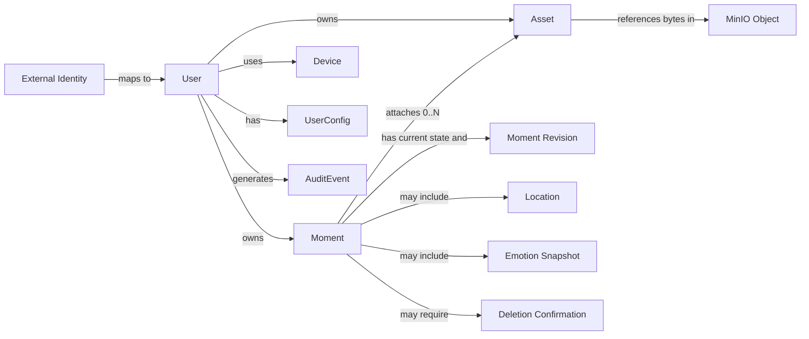

# Moment One 领域模型

> 文档状态：Draft 1.0  
> 更新日期：2026-08-01  
> 适用范围：Moment One Cloud Core / `MomentOneServer`

## 1. 文档目的

本文定义 Moment One 服务端使用的统一业务语言、核心概念、对象关系和业务不变量。

本文描述的是**概念模型**：产品世界里有哪些对象，以及这些对象意味着什么；它不等同于数据库表结构。数据库落表方式见 [PostgreSQL 与 MinIO 存储数据模型](../data/STORAGE_DATA_MODEL.md)。

当 REST API、未来 MCP、Web、移动端和眼镜同步使用同一个名词时，必须遵守本文中的含义，不能在不同入口各自解释一套规则。

## 2. 产品与系统边界

Moment One 是个人生活记忆基础设施。它以 `Moment` 为核心对象，保存用户主动记录或确认保存的生活经历，并为时间线、搜索、回顾和多端同步提供可信数据。

`MomentOneServer` 负责：

- 从可信 Access Token 建立当前用户上下文；
- 执行 Moment 创建、读取、修改、删除和搜索规则；
- 管理版本冲突、幂等、删除确认和审计；
- 管理媒体资产元数据及其访问授权；
- 作为 PostgreSQL 业务数据和 MinIO 媒体对象之间的协调者；
- 为后续眼镜同步、移动端和 MCP 提供统一领域服务。

`MomentOneServer` 不负责：

- 实现 Casdoor 内部的账号密码体系；
- 渲染 Web 页面或托管客户端运行时；
- 把 PostgreSQL 或 MinIO 直接暴露给客户端；
- 把 AI 生成内容自动视为用户确认的事实；
- 在首期提供通用知识库、社交网络、日程系统或专业文件管理能力。

一句话边界：

> 客户端负责采集和展示，服务端负责身份、业务规则、数据真相和授权；PostgreSQL 保存业务事实，MinIO 保存媒体字节。

## 3. 核心概念关系



关系说明：

- 一个内部 `User` 可以映射一个或多个外部身份；
- 一个 `Moment` 必须且只能归属一个用户；
- 一个 `Moment` 可以没有媒体，也可以关联多个 `Asset`；
- `Moment` 保存当前状态，`MomentRevision` 保存历史版本；
- `Asset` 是业务元数据，MinIO Object 是实际文件字节；
- 删除确认只授权一次特定操作，不等同于长期权限；
- `Device` 在同步阶段启用，首期不要求进入核心 CRUD。

## 4. 领域词汇表

### 4.1 User

Moment One 内部的数据主体和所有权边界。

- 内部使用服务端生成的 UUID 标识；
- 不使用邮箱作为身份主键；
- 外部身份通过 `issuer + subject` 映射；
- 用户状态可以限制登录或数据访问；
- 用户 A 不能读取、修改或推断用户 B 的数据是否存在。

### 4.2 External Identity

Casdoor 或未来其他 OIDC Provider 中的账号身份。

稳定身份键是：

```text
issuer + subject
```

邮箱、手机号和显示名仅为资料，不能代替稳定身份键。

多个 External Identity 可以在完成真实 Provider 认证后关联同一 User；如果身份已属于另一个 User，必须进入账号合并流程，不能按相同 email 静默抢占。设备绑定和 MCP 授权不是 External Identity。详细设计见 `IDENTITY_ACCOUNT_LINKING.md`。

### 4.3 Moment

用户在某个时间、地点或情境中保存的一段个人经历、观察或状态。

Moment 是聚合根：标题、正文、分类、标签、发生时间、可选情境和媒体关联的修改，都必须通过 Moment 领域服务执行。

Moment 不等同于：

- 原始音频文件；
- AI 自动生成的总结；
- 搜索索引；
- 页面展示卡片；
- 一次 API 请求。

### 4.4 Moment Revision

Moment 每次成功变更后的逻辑版本。

- 创建后的首个云端版本为 `1`；
- 每次成功修改、删除或恢复后加 `1`；
- 客户端修改时必须提供 `expectedRevision`；
- 版本不匹配时返回 `REVISION_CONFLICT`，不得静默覆盖；
- Revision 是并发控制和同步依据，不是显示给用户的编辑次数。

### 4.5 Category

Moment 的单一主要主题，用于稳定筛选、导航和统计。

当前 v1 值与代码保持一致：

```text
experience
habit
travel
food
growth
emotion
```

语义约束：

- `experience` 是无法归入其他主题的一般经历；
- `emotion` 表示“以情绪变化为主题的记录”；
- 情绪快照是 Moment 的观察属性，不能因为存在情绪字段就自动把分类改为 `emotion`；
- Category 是受控枚举，增加或重命名值属于 API 和数据迁移变更。

### 4.6 Tag

用户或经用户确认后附加到 Moment 的开放标签。

- 一个 Moment 可以有多个标签；
- 同一 Moment 内标签去重；
- 标签不承担权限和系统状态含义；
- AI 可以提出标签建议，但未经确认的建议不是正式 Tag；
- 首期 Tag 只属于 Moment 内容，不建设全局标签知识图谱。

### 4.7 Occurred Time

事件实际发生或用户认为其发生的时间，由下面两个值共同表达：

- `occurredAt`：带时区语义的绝对时刻；
- `timezone`：记录当时所在地或用户选择的 IANA 时区，例如 `Asia/Shanghai`。

`occurredAt` 与 `createdAt` 不同。补录昨天的经历时，发生时间是昨天，创建时间是今天。

### 4.8 Location

Moment 发生地点的可选快照，而不是外部地图实体的永久镜像。

首期建议结构：

```text
name
latitude
longitude
source       device | user | mcp | unknown
```

地点仍处于契约草案阶段；在查询需求稳定前可作为可选结构值保存，不预先建设地点主数据系统。

### 4.9 Emotion Snapshot

用户当时情绪的可选观察值。

首期建议结构：

```text
label        ≤ 12 字，如 "开心"、"难过"
source       user | inferred    （用户确认 or AI 推断）
valence      0-1，正负向（可选，未来扩展）
arousal      0-1，激动/平静（可选，未来扩展）
```

`source=inferred` 表示系统推断，不能伪装成用户确认。Emotion Snapshot 与 Category 是不同概念：存在情绪字段不会自动把分类改为 `emotion`。

### 4.10 Asset

用户上传并由服务端控制访问的媒体资源元数据。

Asset 可以表示图片、音频、视频或未来支持的附件。它不保存二进制内容，只保存：

- 所有者；
- 类型和 MIME；
- 文件大小与校验值；
- 对象存储位置；
- 上传和清理状态。

只有状态为 `ready` 且归属当前用户的 Asset 才能关联到 Moment。

### 4.11 AI-derived Content

由模型、转写服务或规则生成，可重新计算的派生内容，例如：

- `aiSummary`；
- 语音转写；
- 标签建议；
- 情绪推断；
- 搜索向量。

领域规则：

- 派生内容不能自动覆盖用户原文；
- 应能识别其来源和基于哪个 Moment Revision 生成；
- 首期可以把 `aiSummary` 保存在 Moment 当前快照中；
- 当需要保存多次生成结果、模型信息或用户采纳状态时，再引入独立 `AI Artifact` 模型。

### 4.12 Idempotency Record

写请求去重记录。它回答：“同一个用户的同一种操作是否已经以同一请求内容成功执行过？”

它不是业务对象本身，但属于服务端一致性事实，必须持久化保存。

### 4.13 Deletion Confirmation

一次性的高风险操作授权票据。

它绑定：

- 当前用户；
- 目标 Moment；
- 删除动作；
- 目标 Revision 快照；
- 过期时间；
- 是否已经使用。

确认票据过期、已使用、用户不匹配或 Revision 已变化时，不能执行删除。

### 4.14 Audit Event

对安全相关访问或业务动作的不可变描述，例如 Moment 创建、修改、删除、媒体上传或 Agent 查询。

审计事件保存“谁在什么时候对什么执行了什么，以及结果如何”，但不复制完整私密正文、Token 或签名 URL。

### 4.15 Device

代表一个可被用户识别、撤销并参与同步的客户端安装实例。

Device 在离线同步阶段使用；普通 Web 会话不必都建模为永久 Device。

### 4.16 DeviceBinding

设备与用户的**长期绑定关系**，扫码绑定（QR Binding）的产物。

```text
DeviceBinding:
  bindingId        绑定唯一标识（UUID）
  userId           绑定到的用户账号
  deviceId         设备唯一标识（引用 Device）
  scope            授权范围（如 moments.read moments.write）
  status           active | revoked | expired
  boundAt          绑定时间
  lastActiveAt     最后活跃时间
  revokedAt        撤销时间（status=revoked 时填写）
  refreshTokenHash   Refresh Token 哈希（不存明文，滚动续期 90 天）
```

核心特性：

- 扫码建立的不是一次性 Token，而是设备与账号的长期绑定关系
- 绑定后 Token 可以过期和刷新，但绑定关系持续存在
- 用户可在 Web 端查看所有已绑定设备、调整 Scope 或撤销绑定
- 撤销绑定后，该设备的所有 Token（Access / Refresh）立即失效
- 一副眼镜只能绑定到一个用户账号（同一 deviceId 不允许多账号绑定）
- Token 生命周期：Access Token（1h）→ Refresh Token（90d 滚动续期）；Refresh Token 每次使用重置 90 天倒计时，只要 90 天内用过一次眼镜就永不需重新扫码；连续 90 天未使用或绑定撤销时才需要重新扫码

详见 `docs/roadmap/MCP_MVP_PLAN.md` §2.5。

## 5. Moment v1 字段规范

### 5.1 当前快照

| 字段 | 类型 | 写入方 | 必填 | 语义与约束 |
|---|---|---:|---:|---|
| `id` | UUID | 客户端或服务端 | 是 | 全局标识；为离线创建预留客户端生成 UUID 的能力 |
| `userId` | UUID | 服务端 | 是 | 必须来自认证上下文，客户端不得指定目标用户 |
| `title` | string | 用户 | 是 | 去除首尾空白后非空；具体长度由 API 契约冻结 |
| `description` | string/null | 用户 | 否 | 用户正文；空字符串应规范化为 null 或按契约统一处理 |
| `voiceInput` | string/null | 用户/转写流程 | 否 | 原始口述文本或确认后的转写，不是音频文件 |
| `aiSummary` | string/null | 系统 | 否 | 可替换派生内容，不能覆盖 title/description |
| `category` | enum | 用户/经确认的建议 | 是 | 使用受控 v1 枚举 |
| `tags` | string[] | 用户/经确认的建议 | 是 | 可为空；去重并限制数量、单项长度 |
| `occurredAt` | datetime | 用户/客户端 | 是 | 事件发生时间；API 使用 ISO 8601，数据库使用 `timestamptz` |
| `timezone` | string | 用户/客户端 | 是 | IANA 时区名称；不只保存 `+08:00` 这类固定偏移 |
| `location` | object/null | 用户/客户端 | 否 | 可选地点快照；source: device\|user\|mcp\|unknown |
| `emotion` | object/null | 用户/系统 | 否 | label + source(user\|inferred) + 可选 valence/arousal |
| `provenance` | object | 客户端/服务端 | 否 | v1 正式字段；source: rokid\|mobile\|web\|agent\|mcp\|import + 可选 deviceId/clientId/mcpServerId/mcpToolName/externalId；创建后不可篡改。`deviceId` 用于设备来源的 Moment（如眼镜），引用 `devices.id` |
| `media` | object/null | 用户/客户端 | 否 | v1 正式字段；assetIds: string[]（引用 assets 表）+ 可选 caption；Phase 2 启用 |
| `revision` | integer | 服务端 | 是 | 本地 pending=0，云端首次=1；成功变更后递增 |
| `createdAt` | datetime | 服务端 | 是 | 记录首次进入云端的时间 |
| `updatedAt` | datetime | 服务端 | 是 | 当前快照最近一次变更时间 |
| `deletedAt` | datetime/null | 服务端 | 否 | 非空表示 Tombstone；默认查询不返回 |

### 5.2 字段所有权

字段所有权用于防止客户端覆盖服务端事实：

```text
用户可直接修改：title, description, category, tags, occurredAt,
                timezone, location, 用户来源的 emotion

系统生成但可展示：aiSummary, 推断来源的 emotion

创建时写入、之后不可篡改：provenance

仅服务端修改：userId, revision, createdAt, updatedAt, deletedAt
```

所有 API 请求和响应字段采用 `camelCase`；Python 领域对象和数据库字段采用 `snake_case`，在传输层显式映射。

### 5.3 内容来源规则

- 用户原始内容和系统派生内容必须可区分；
- 外部 MCP 或第三方导入内容默认只是候选信息；
- 需要长期保存时，必须转换为 Moment 并记录来源；
- 系统不能在用户不知情时把推断内容写成用户陈述；
- 搜索索引、摘要、缩略图等派生数据可以重建，不作为唯一事实副本。

## 6. 核心业务不变量

以下规则无论通过 REST、未来 MCP、后台任务还是同步入口执行，都必须保持：

1. **所有权**：Moment 和 Asset 只能由其所有者访问；身份来自认证上下文。
2. **不可跨用户关联**：Moment 不能关联其他用户的 Asset。
3. **乐观锁**：更新和删除必须验证 `expectedRevision`。
4. **幂等写入**：创建及其他需要重试的写操作必须支持 Idempotency Key。
5. **删除为状态变化**：首期删除先产生 Tombstone，不立即丢失同步所需事实。
6. **高风险确认**：删除必须使用与目标 Revision 绑定的一次性确认。
7. **媒体就绪**：未完成或校验失败的 Asset 不能出现在有效 Moment 中。
8. **派生内容可重建**：AI 摘要、搜索文本和缩略图不能成为唯一事实来源。
9. **审计不泄密**：审计能说明动作，但不能复制 Token、完整媒体或敏感正文。
10. **统一规则入口**：REST Route、MCP Tool 和同步处理器只能调用领域服务，不能各自实现业务规则。

## 7. 聚合与事务边界

### 7.1 创建 Moment

一个数据库事务内完成：

- 校验 Idempotency Key；
- 创建 Moment 当前快照；
- 创建 Revision 1 快照；
- 建立已就绪 Asset 关联；
- 写入审计事件；
- 保存幂等响应记录。

MinIO 上传不和数据库事务强绑定。上传通过 `upload intent -> object upload -> complete` 状态机处理。

### 7.2 修改 Moment

一个数据库事务内完成：

- 校验所有权和 `expectedRevision`；
- 条件更新当前快照并递增 Revision；
- 保存新 Revision 快照；
- 更新媒体关联；
- 写入审计及幂等结果。

### 7.3 删除 Moment

分为两个用例：

```text
delete preview
  -> 返回影响摘要、confirmationId、expiresAt、revision

delete confirm
  -> 校验票据和 revision
  -> 设置 deletedAt，revision + 1
  -> 写 Revision、Audit、Idempotency
```

媒体不在确认事务中立即物理删除。失去引用的媒体进入延迟清理流程。

## 8. 当前实现状态

截至 2026-08-01：

- 已有 `Moment` Python dataclass、Category 枚举和 Repository 接口示例；
- 已有 `MomentService.get` 示例；
- `location`、`emotion`、创建/修改/删除等规则尚未在代码中实现；
- PostgreSQL 业务模型和 Alembic migration 尚未创建；
- 本文定义目标领域边界，不表示所有能力已经交付。

## 9. 暂不进入 v1 的概念

除非出现明确需求，v1 不建设：

- 社交关注、点赞、评论和公开动态；
- 全局人物关系图谱；
- 地点主数据或 GIS 服务；
- 全局标签知识图谱；
- 复杂 Habit 计划、连续打卡和奖惩系统；
- 通用日程或任务管理；
- 多用户共同编辑同一 Moment；
- AI 生成内容的完整模型版本管理平台。

这些能力未来如需引入，应先重新评审是否仍属于 Moment 聚合。
